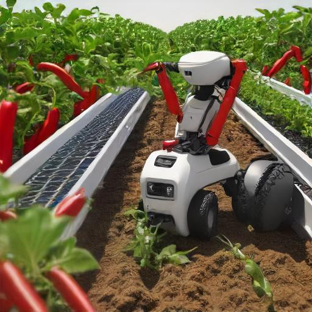

# Robot harvester: works perfect

> **Robot harvester: works perfect**\
> Me Myself, Some Supervisor, Some Other Person
> Paper: https://todo.nl

## About
Official implementation of the paper 'Robot harvester: perfect harvesting of fruits'. This software is perfect in harvesting fruits. 

## Installation
Describe here how to install your software (if relevant). Which Python version does it require? Which dependencies do you have to install, e.g.:

This software is tested on Python 3.10. To install the dependencies, run:
```
pip3 install -r requirements.txt
```

## Usage
Describe how to run your code, e.g.:

To start training on your custom dataset:
```
python3 train.py <<path_to_custom_dataset>>
```

## Citation
```
<<ADD CITATION IN BIBTEX FORMAT>>
```
