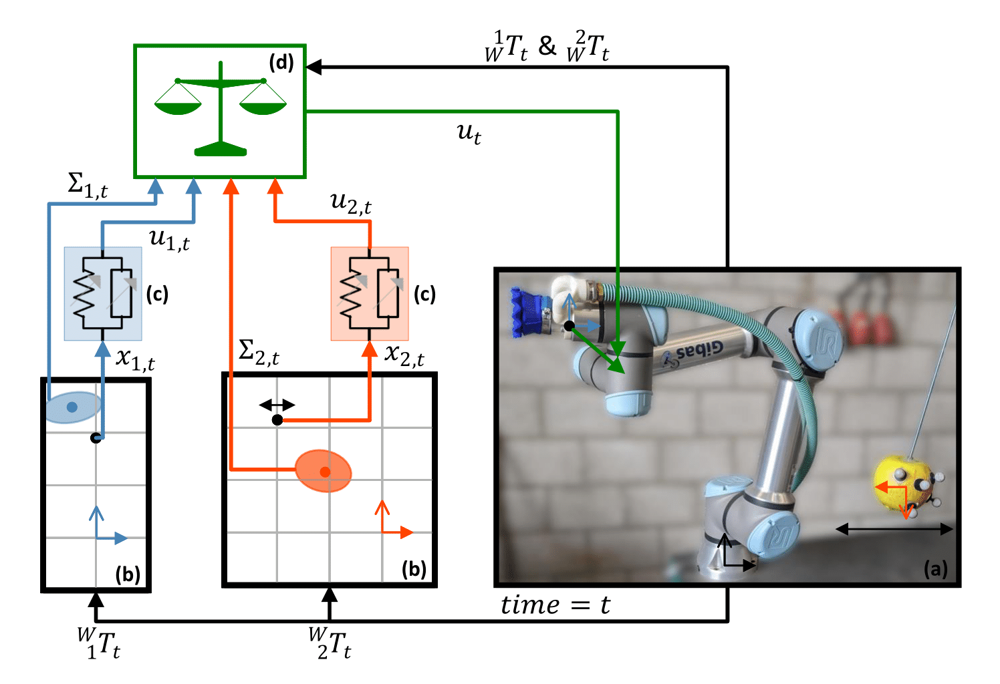

# DualLQR: Efficient Grasping of Oscillating Apples using Task Parameterized Learning from Demonstration

> **DualLQR: Efficient Grasping of Oscillating Apples using Task Parameterized Learning from Demonstration**\
> Robert van de Ven, Ard Nieuwenhuizen, Eldert J. van Henten, and Gert Kootstra\
> Paper: https://arxiv.org/abs/2409.16957

## About
Official implementation of the paper 'DualLQR: Efficient Grasping of Oscillating Apples using Task Parameterized Learning from Demonstration'. Work submitted to ICRA 2025.
This repository contains the code of the DualLQR, code for testing, and code for analysis. 

## Usage
The folder ``simulation_experiments`` contains the scripts used to perform the simulation experiments. \
The folder ``apple_grasping_experiments`` contains the scripts used to perform the apple grasping experiments. It does not include the hand-eye calibration of the OptiTrack system. \
The folder ``analysis_experiments`` contains the scripts used to analyze both experiments, containing sub-folders for each experiment. 

## Citation
```
@misc{vandeven2024duallqrefficientgraspingoscillating,
      title={DualLQR: Efficient Grasping of Oscillating Apples using Task Parameterized Learning from Demonstration}, 
      author={Robert van de Ven and Ard Nieuwenhuizen and Eldert J. van Henten and Gert Kootstra},
      year={2024},
      eprint={2409.16957},
      archivePrefix={arXiv},
      primaryClass={cs.RO},
      url={https://arxiv.org/abs/2409.16957}, 
}
```
